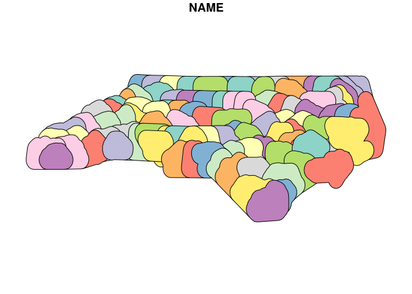

<!-- README.md is generated from README.Rmd. Please edit that file -->

# qgis

<!-- badges: start -->

<!-- badges: end -->

**qgis** is automatically generated package which originates from
[qgisprocess](https://github.com/r-spatial/qgisprocess) and aims to
provide calls and simple documentation for each
[QGIS](https://qgis.org/en/site/) functions available in core and the
most important algorithm providers ([GRASS
GIS](https://grass.osgeo.org/) and [Saga](http://www.saga-gis.org/)).
The algorithms are automatically extracted from fresh install of latest
**QGIS** version on **Ubuntu** with packages for **GRASS** and **SAGA**
installed.

The package is highly experimental and things are quite likely to change
a lot in the future. The definition of individual functions can change
if it changes in the QGIS.

## Latest version

Latest package version **3.40.3.9001** is build against QGIS version
**3.40.3-Bratislava**.

## Installation

You can install the released version of **qgis** from GitHub with:

    # install.package("remotes")
    remotes::install_github("JanCaha/r_package_qgis")

The information about local installation are in a vignette
`vignette("local_instalation")`.

## Using/Loading the package

The idea of the package is that it should not be loaded directly using
`library(qgis)` but rather functions should be called using
`qgis::function_name()` syntax. Even though tests showed ([see them
here](https://github.com/JanCaha/r_package_qgis/issues/32#issuecomment-1431139318))
that loading the package does not takes significant amount of resources.
The author’s suggestion is still to avoid loading and use the
`package::function()` notation.

## Functions names

The names of the functions follow general pattern of
`algorithm-provider_algorithm-id` with only the native **QGIS**
algorithms using `qgis` algorithm provider instead of `native`.

The available providers are: 3d, gdal, grass, native, qgis, sagang. The
overall number of available algorithms is 1180.

## Functions parameters

Every functions carries three boolean parameters that allow better
utilization of these functions in R pipelines and reports. These are
`.complete_output`, `.quiet` and `.messages`. The default setting of
these variables is such that the calls are as silent as possible and
create pretty much no output in R console at all.

Parameter `.quiet` (default values is `TRUE`) is the same as in
`qgisprocess::qgis_run_algorithm()` only in `qgis` the functions are
silent by default while in `qgisprocess` they are talkative.

Parameter `.messages` (default value is `FALSE`) controls if messages
produced by `qgisprocess` (such as information about parameters not
being set etc.) should be outputed or not.

Parameter `.complete_output`(default values is `TRUE`) specifies whether
whole QGIS process output should be returned or only first variable in
it, which is usually the main output.

These three parameters can also be set as R session options using
`options(qgis.quiet = TRUE)`, `options(qgis.messages = FALSE)` and
`options(qgis.complete_output = TRUE)` to avoid the need to set them for
every individual function call.

## Example

    qgis::qgis_buffer()

This allows you to show the help page for the function (at least in
**RStudio** using the key shortcut **F1**).

## Example in the wild

This example uses `qgisprocess` pipe ability to directly load output to
**R**.

    library(sf)
    #> Linking to GEOS 3.10.2, GDAL 3.4.1, PROJ 8.2.1; sf_use_s2() is TRUE

    nc <- st_read(system.file("shape/nc.shp", package="sf"), quiet = TRUE)

    buffered <- qgis::qgis_buffer(INPUT = nc, 
                                  DISTANCE = 0.2, 
                                  END_CAP_STYLE = "Flat") %>% 
      st_as_sf()

    plot(buffered["NAME"])

