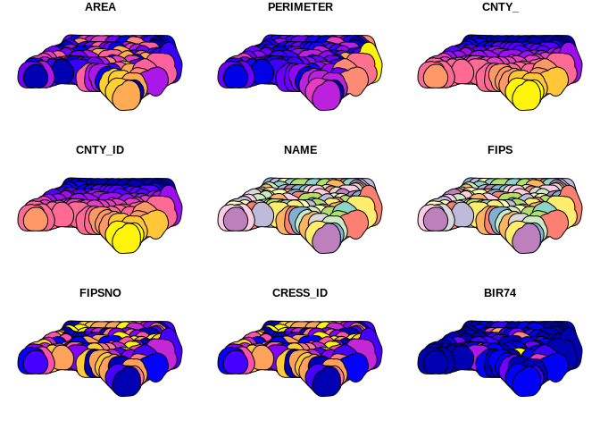

<!-- README.md is generated from README.Rmd. Please edit that file -->

qgis
====

<!-- badges: start -->

<!-- badges: end -->

**qgis** is automatically generated package which originates from
[qgisprocess](https://github.com/paleolimbot/qgisprocess) and aims to
provide calls and simple documentation for each
[QGIS](https://qgis.org/en/site/) functions available in core and the
most important algorithm providers ([GRASS
GIS](https://grass.osgeo.org/) and [Saga](http://www.saga-gis.org/)).
The algorithms are automatically extracted from fresh install of latest
**QGIS** version on **Ubuntu** with packages for **GRASS** and **SAGA**
installed.

The package is highly experimental and things are quite likely to change
a lot in the future. The definition of individual functions can change
if it changes in the QGIS.

Installation
------------

You can install the released version of **qgis** from GitHub with:

    # install.package("remotes")
    remotes::install_github("JanCaha/r_package_qgis")

Personal instalation
--------------------

If you want to install the package with your personal settings,
including algorithms for your installed plugins etc. you can do so by
downloading the repository and running following commands from the
project.

    # install packages necessary to build the package code
    source("./build-package/install_save_deps.R")

    # install dependencies for the package
    remotes::install_deps(dependencies = TRUE)

    # update package description
    source("./build-package/update_Description.R")

    # build the package code and documentation
    # this takes rather long time (roughly 22 minutes for basic QGIS installation)
    source("./build-package/build_QGIS_functions.R")

    # check and install the package
    devtools::check()
    devtools::install()

Functions names
---------------

The names of the functions follow general pattern of
`algorithm-provider_algorithm-id` with only the native **QGIS**
algorithms using `qgis` algorithm provider instead of `native`.

The available providers are: 3d, gdal, grass7, native, qgis, saga. The
overall number of available algorithms is 976.

Example
-------

The package is not meant to be load directly as this would significant
number of functions (&lt;900). Instead the functions should be called
as:

    qgis::qgis_buffer()

This allows you to show the help page for the function (at least in
**RStudio** using the key shortcut **F1**).

Example in the wild
-------------------

This example uses `qgisprocess` pipe ability to directly load output to
**R**.

    library(sf)
    #> Linking to GEOS 3.8.0, GDAL 3.0.4, PROJ 6.3.1

    fname <- system.file("shape/nc.shp", package="sf")
    nc <- st_read(fname)
    #> Reading layer `nc' from data source `/home/runner/work/_temp/Library/sf/shape/nc.shp' using driver `ESRI Shapefile'
    #> Simple feature collection with 100 features and 14 fields
    #> geometry type:  MULTIPOLYGON
    #> dimension:      XY
    #> bbox:           xmin: -84.32385 ymin: 33.88199 xmax: -75.45698 ymax: 36.58965
    #> geographic CRS: NAD27

    buffered <- qgis::qgis_buffer(INPUT = nc, 
                                  DISTANCE = 0.5, 
                                  END_CAP_STYLE = "Flat") %>% 
      st_as_sf()
    #> Argument `SEGMENTS` is unspecified (using QGIS default value).
    #> Using `JOIN_STYLE = "Round"`
    #> Argument `MITER_LIMIT` is unspecified (using QGIS default value).
    #> Argument `DISSOLVE` is unspecified (using QGIS default value).
    #> Using `OUTPUT = qgis_tmp_vector()`
    #> Running qgis_process run 'native:buffer' \
    #>   '--INPUT=/tmp/Rtmp5mnSSB/filea43f681cd0c/filea43f205f59b4.gpkg' \
    #>   '--DISTANCE=0.5' '--END_CAP_STYLE=1' '--JOIN_STYLE=0' \
    #>   '--OUTPUT=/tmp/Rtmp5mnSSB/filea43f681cd0c/filea43f76afbddb.gpkg'
    #> QStandardPaths: XDG_RUNTIME_DIR not set, defaulting to '/tmp/runtime-runner'
    #> 
    #> ----------------
    #> Inputs
    #> ----------------
    #> 
    #> DISTANCE:    0.5
    #> END_CAP_STYLE:   1
    #> INPUT:   /tmp/Rtmp5mnSSB/filea43f681cd0c/filea43f205f59b4.gpkg
    #> JOIN_STYLE:  0
    #> OUTPUT:  /tmp/Rtmp5mnSSB/filea43f681cd0c/filea43f76afbddb.gpkg
    #> 
    #> 0...10...20...30...40...50...60...70...80...90...
    #> ----------------
    #> Results
    #> ----------------
    #> 
    #> OUTPUT:  /tmp/Rtmp5mnSSB/filea43f681cd0c/filea43f76afbddb.gpkg

    plot(buffered)
    #> Warning: plotting the first 9 out of 14 attributes; use max.plot = 14 to plot
    #> all

